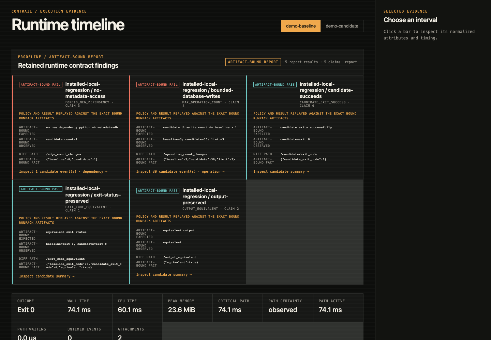
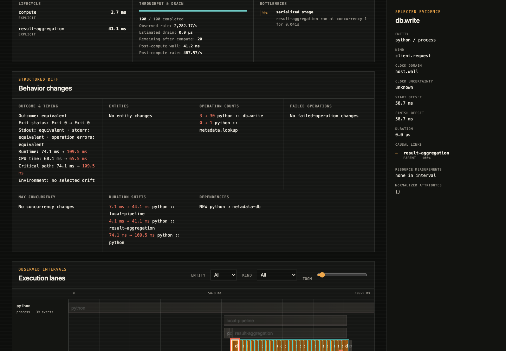

# Contrail

**Turn one run into an explanation—and a regression into a contract failure
with exact runtime evidence.**

Contrail is a local-first toolkit for finite jobs, test runs, and workflows. It
captures a portable `.runpack`, explains where the run spent its time, compares
runtime behavior, and gates changes on evidence-backed invariants.

No account. No hosted collector. No application changes for zero-touch capture.



## What you get

| Tool | Answers |
|---|---|
| **BatchScope** | Where did this run spend its wall-clock time? |
| **RunDiff** | What changed between the baseline and candidate? |
| **Proofline** | Which runtime invariant failed, and what exact evidence proves it? |

All three read the same versioned SQLite artifact. Capture once; investigate
without rerunning the workload.

## See the first failure in two minutes

Contrail currently runs from source and supports Python 3.12–3.14 on Linux and
macOS. Install [`uv`](https://docs.astral.sh/uv/), then:

```bash
git clone https://github.com/javess/contrail.git
cd contrail
uv sync --locked
uv run contrail demo
```

The offline demo keeps the program result unchanged while introducing two
runtime regressions: database writes jump from 3 to 30 and a new metadata
dependency appears.

```bash
uv run contrail report \
  contrail-demo/baseline.runpack contrail-demo/candidate.runpack \
  --contract contrail-demo/contract.yaml
```

```text
Executive summary
  runtime behavior: equivalent
  candidate bottleneck: serialized_stage (90%)
    result-aggregation ran at concurrency 1 for 0.041s
  contracts: 3 passed, 2 failed, 0 unverifiable

Operation count changes
  db.write          3 → 30 (+900.0%)
  metadata.lookup   0 → 1 (new)

New runtime dependencies
  python → metadata-db [calls]: 0 → 1
```

Open the retained evidence locally:

```bash
uv run contrail serve contrail-demo/baseline.runpack \
  --compare contrail-demo/candidate.runpack \
  --proofline-report contrail-demo/proofline-report.json
```



## Capture your own run

Start passive, then move up only when you need more evidence:

```bash
uv run contrail record --name checkout -- ./run-checkout
uv run contrail analyze checkout.runpack
```

| Level | Adds | Tradeoff |
|---|---|---|
| `passive` | outcome, wall/CPU time, peak RSS, output identities | default; no injected observer |
| `process` | bounded process tree, per-process RSS and CPU | controller polling |
| `sample` | Python stack samples plus safe subprocess, HTTP, and network boundaries | statistical; injected observer |
| `deep` | exact Python/native calls plus supported database, queue, task, HTTP, WSGI, and Uvicorn boundaries | intrusive and intentionally expensive |

```bash
uv run contrail record --capture-level deep --name api -- python app.py
uv run contrail analyze api.runpack
```

Deep capture can attribute inbound Uvicorn h11/httptools requests to the exact
application function without importing Uvicorn, changing the app, or retaining
routes, headers, bodies, queries, client addresses, locals, or exception
messages. WebSockets are ignored rather than misclassified.

See [capture and evidence](docs/capture.md) for supported boundaries, privacy,
budgets, and limitations.

## Make regressions executable

Proofline contracts are small YAML policies over baseline and candidate
evidence:

```yaml
name: checkout-regression
assertions:
  - type: candidate_exit_success
  - type: output_equivalent
  - type: forbid_new_dependency
    from: python
    to: metadata-db
  - type: max_operation_count
    operation: db.write
    relative_to: baseline
    factor: 1.2
```

```bash
uv run contrail verify contract.yaml \
  --baseline baseline.runpack \
  --candidate candidate.runpack \
  --explain
```

Exit status is `0` when every claim passes, `1` when a claim fails or cannot be
verified, and `2` for invalid input. Explained reports bind each verdict to the
exact runpack bytes used to evaluate it.

## Bring your evidence

Built-in providers import or enrich exported OpenTelemetry, Kubernetes,
Prometheus, and Temporal evidence. They normalize into the same core model as
local capture.

```bash
uv run contrail providers
uv run contrail import-otel trace.json --output trace.runpack
uv run contrail enrich-prometheus trace.runpack metrics.json \
  --output enriched.runpack
```

Providers are modular. Installed third-party providers use standard Python
entry points, remain disabled until explicitly enabled, and add commands without
editing Contrail’s parser or dispatcher. See [provider development](docs/providers.md).

## Local by design

- Runpacks stay on your machine; Contrail does not upload telemetry.
- Output content and environment values are excluded unless explicitly requested.
- Zero-touch semantic capture stores bounded classifications and timings, not
  request bodies, SQL, cache keys, broker payloads, task arguments, locals, or
  exception messages.
- Missing or truncated evidence becomes partial—not a confident guess.

Review the [threat model](docs/threat-model.md) before sharing runpacks or
reports; imported telemetry and opt-in attachments may still contain secrets.

## Documentation

- [Browse all documentation](docs/README.md)
- [Start and choose a capture level](docs/capture.md)
- [Write a Proofline contract](docs/contracts.md)
- [Run Proofline in CI](docs/ci.md)
- [Query a runpack](docs/querying.md)
- [Build a provider](docs/providers.md)
- [Understand the architecture](docs/architecture.md)
- [Read support and current limits](docs/support.md)
- [Use structured output](docs/machine-output.md)
- [Develop Contrail](docs/development.md)

Contrail is a bounded `0.9.0` beta, not a hosted observability service. Exported
provider inputs are files, not live collectors; logical reconstruction depends
on available causal or correlation evidence.

Start with `uv run contrail demo`, then follow
[the contribution guide](CONTRIBUTING.md). Report security issues privately via
[SECURITY.md](SECURITY.md).

[Source](https://github.com/javess/contrail) ·
[Issues](https://github.com/javess/contrail/issues) ·
[MIT License](LICENSE)
